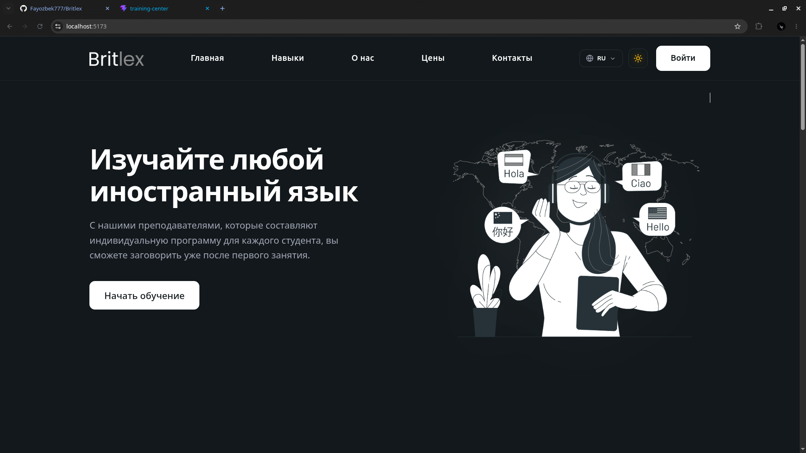
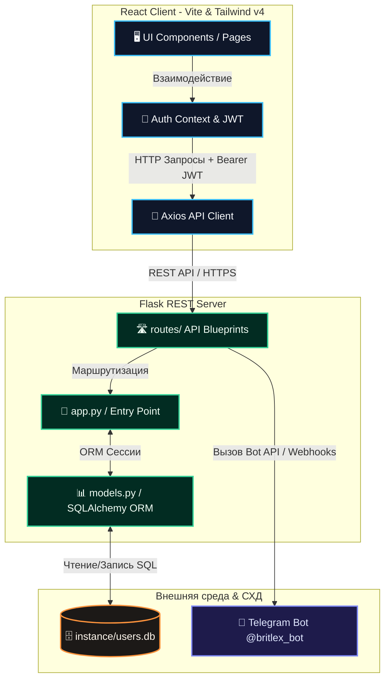
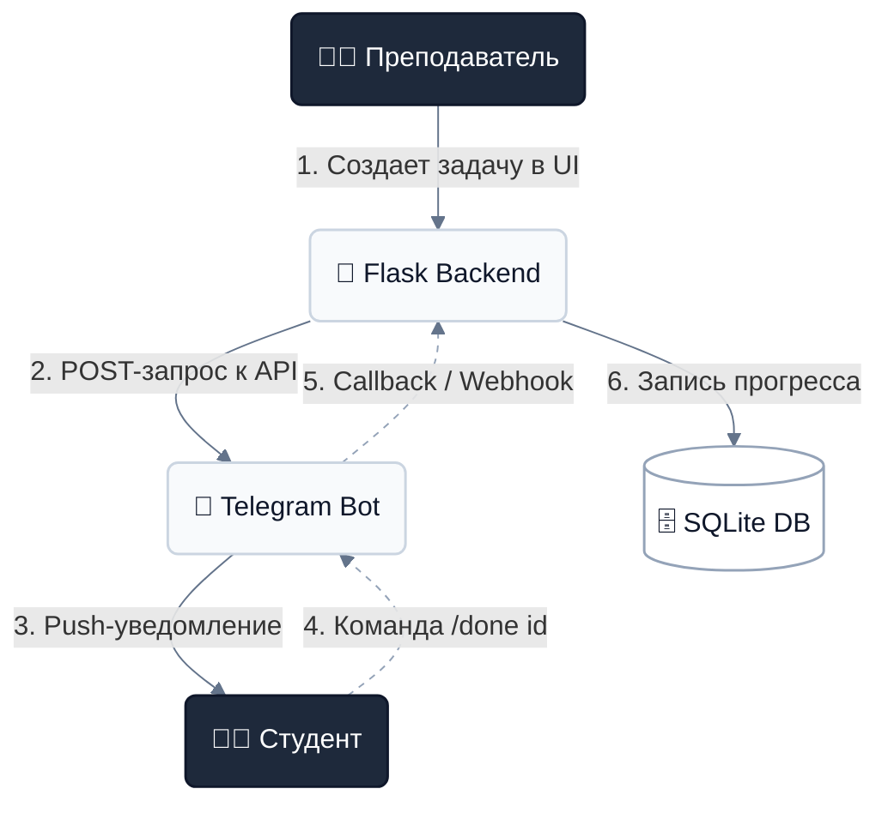
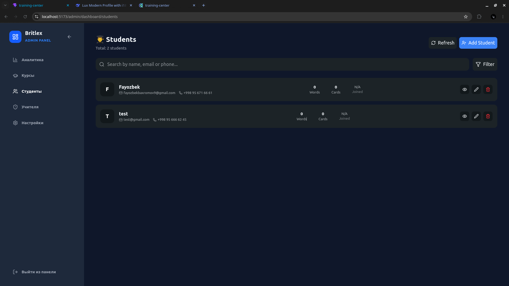
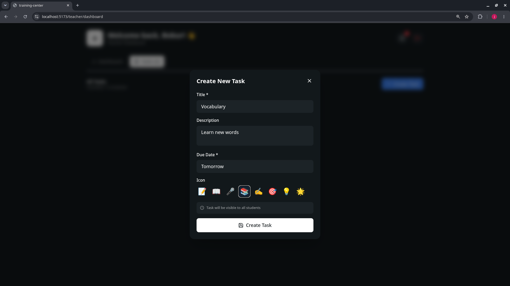
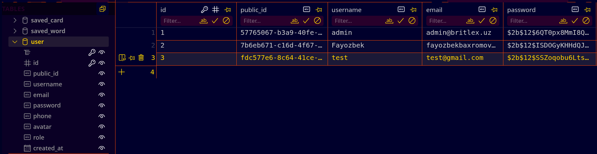

# 🎓 Britlex Training Center — Student Dashboard

> **Lux Modern & Interactive Educational Ecosystem** — Инновационный личный кабинет для студентов, преподавателей и администраторов с умной синхронизацией через Telegram-бота.

<p align="center">
  
</p>


---

## 🛠️ Технологический стек / Tech Stack

### 🚀 Frontend
* **React 19 (Vite):**
* **Tailwind CSS v4:**
* **Framer Motion / Gsap:**
* **i18next:**  
* **Axuis:** 

### 🐍 Backend & Integrations
* **Python 3 / Flask:**
* **Security Cross-Origin:** 
* **Telegram Bot:** 
* **Storage:**

### 🔐 Security & Admin Panel
* **JWT Tokens:** 
* **Middleware:**
* **Hash Passwords:**  
* **Control Panel:** 

### 🗄️ Database & Storage
* **DB:**  
* **ORM:**  
* **Migrations** 

---


## ✨ Основные возможности / Features

### 👥 Пользователи

* ✅ 🔐 JWT Authentication
* ✅ 👨‍🎓 Student Dashboard
* ✅ 👨‍🏫 Teacher Dashboard
* ✅ 👨‍💼 Admin Dashboard
* ✅ 🔒 Role-Based Access Control

### 🎨 Интерфейс

* ✅ 🌙 Dark / Light Theme
* ✅ 🌍 Multi-language (i18next)
* ✅ 📱 Fully Responsive Design

### ⚙️ Система

* ✅ ⚡ High Performance REST API
* ✅ 🤖 Telegram Bot Notifications
* ✅ 📊 Analytics Dashboard


## 🗺️ Архитектура системы


### 🤖 Архитектура взаимодействия Telegram-бота



```text
learning-center/
│
├── 📁 backend/                        # Flask REST API
│   ├── 📄 app.py                      # Точка входа Flask
│   ├── 📄 models.py                   # Модели базы данных
│   ├── 📄 requirements.txt            # Python зависимости
│   ├── 🔐 localhost.pem               # SSL сертификат
│   ├── 🔐 localhost-key.pem           # SSL ключ
│   │
│   ├── 📁 instance/                   # Локальные данные
│   │   └── 📄 users.db                # SQLite база
│   │
│   ├── 📁 routes/                     # REST API маршруты
│   └── 📁 venv/                       # Виртуальное окружение
│
├── 📁 frontend/                       # React приложение
│   ├── 📄 index.html                  # HTML шаблон
│   ├── 📄 vite.config.js              # Конфигурация Vite
│   ├── 📄 package.json                # npm зависимости
│   ├── 📄 tailwind.config.js          # Настройки Tailwind
│   │
│   ├── 📁 public/                     # Публичные файлы
│   │
│   └── 📁 src/                        # Исходный код
│       ├── 📄 main.jsx                # Точка входа
│       ├── 📄 App.jsx                 # Главный компонент
│       ├── 📄 index.css               # Глобальные стили
│       ├── 📄 App.css                 # Дополнительные стили
│       │
│       ├── 📁 api/                    # API функции
│       │   └── 📄 telegram.js         # Telegram API
│       │
│       ├── 📁 assets/                 # Медиа ресурсы
│       │
│       ├── 📁 hooks/                  # React Hooks
│       │   ├── 📄 useAuth.js          # Авторизация
│       │   └── 📄 useTheme.js         # Смена темы
│       │
│       ├── 📁 i18n/                   # Локализация
│       │
│       ├── 📁 services/               # HTTP сервисы
│       │   └── 📄 axios.js            # Axios клиент
│       │
│       ├── 📁 routes/                 # React Router
│       │   ├── 📄 AppRoutes.jsx       # Все маршруты
│       │   ├── 📄 ProtectedRoutes.jsx # Защита маршрутов
│       │   └── 📄 Roles.jsx           # Роли доступа
│       │
│       ├── 📁 context/                # React Context
│       │   ├── 📁 auth/               # Авторизация
│       │   │   └── 📄 AuthContext.jsx # Auth Context
│       │   │
│       │   └── 📁 theme/              # Тема приложения
│       │       └── 📄 ThemeContext.jsx# Theme Context
│       │
│       ├── 📁 components/             # UI компоненты
│       │   ├── 📁 layout/             # Макеты страниц
│       │   │   ├── 📁 admin/          # Админ интерфейс
│       │   │   ├── 📁 footer/         # Подвал сайта
│       │   │   └── 📁 navbar/         # Навигация
│       │   │
│       │   └── 📁 ui/                 # Базовые элементы
│       │       ├── 📁 button/         # Кнопки
│       │       ├── 📁 loader/         # Индикаторы загрузки
│       │       └── 📁 modal/          # Модальные окна
│       │
│       └── 📁 pages/                  # Страницы сайта
│           ├── 📁 Admin/              # Админ панель
│           ├── 📁 Auth/               # Авторизация
│           ├── 📁 Forbidden/          # Ошибка 403
│           ├── 📁 Home/               # Главная страница
│           ├── 📁 Legal/              # Правовая информация
│           ├── 📁 NotFound/           # Ошибка 404
│           ├── 📁 Profile/            # Профиль пользователя
│           └── 📁 Teacher/            # Кабинет преподавателя
│
└── 📁 images/                         # Скриншоты проекта
    ├── 🖼️ UI.png                      # Интерфейс студента
    ├── 🖼️ adminDashboard.png          # Панель администратора
    ├── 🖼️ teacherGiveTask.png         # Выдача заданий
    └── 🖼️ database.png                # Схема БД
```


# 📸 Project Preview

| Student Dashboard | Administrator Dashboard |
|:-----------------:|:-----------------------:|
| Современный интерфейс студента | Управление системой |
|  |

| Teacher Dashboard | Database Schema |
|:-----------------:|:---------------:|
| Выдача заданий студентам | Структура базы данных |
|  |  |
